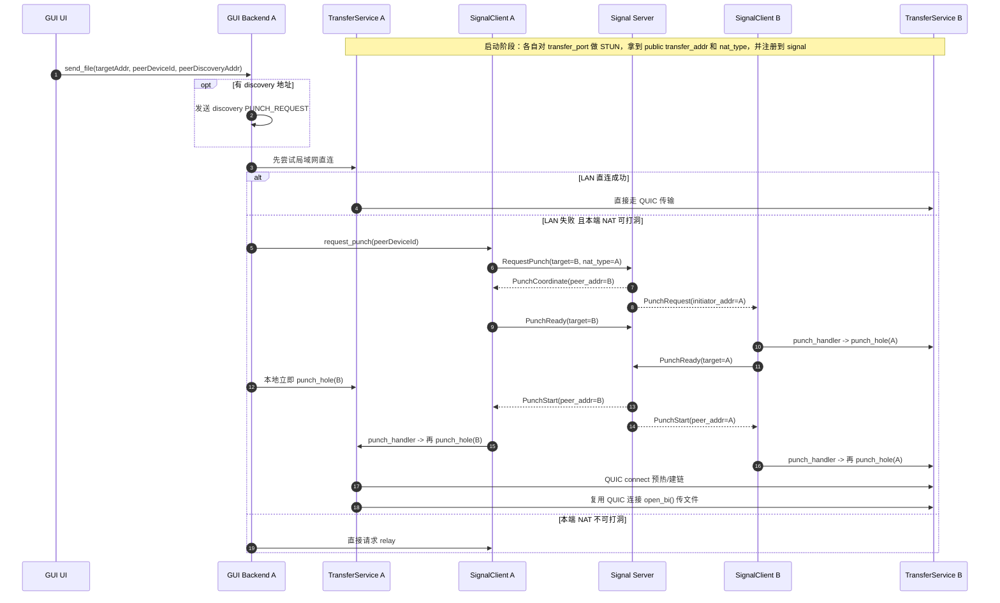

# NetFile

NetFile 是一个高性能的局域网/跨NAT文件传输工具，支持设备发现、文件传输、断点续传、压缩传输、TLS 加密、NAT 穿透、信令服务器好友系统等功能。

## 核心特性

- **设备发现**: 基于 UDP 广播的自动设备发现，支持局域网内设备互相发现
- **文件传输**: 基于 TCP 的可靠文件传输，支持分块传输和断点续传
- **文件夹传输**: 支持递归传输文件夹，保留完整目录结构
- **进度跟踪**: 实时显示传输进度、速度和预计剩余时间
- **压缩传输**: 使用 zstd 算法智能压缩，自动判断压缩收益
- **安全机制**: 支持设备授权、密码保护和 TLS 加密
- **NAT 穿透**: 支持 STUN 协议获取公网 IP 和 UDP 打洞
- **信令服务器**: 跨 NAT 的好友系统、邀请码配对、消息中继
- **TURN 中继**: 信令服务器可选开启文件传输中继，双方均在 NAT 后仍可传输文件
- **跨平台**: 支持 Windows、Linux、macOS

## 架构设计

### 模块结构

```
netfile/
├── crates/
│   ├── netfile-core/          # 核心库
│   │   └── src/
│   │       ├── config.rs      # 配置管理
│   │       ├── discovery/     # 设备发现
│   │       ├── transfer/      # 文件传输
│   │       ├── protocol.rs    # 协议定义
│   │       ├── auth.rs        # 身份验证
│   │       ├── compression.rs # 压缩模块
│   │       ├── tls.rs         # TLS 加密
│   │       ├── stun.rs        # STUN 协议
│   │       ├── hole_punch.rs  # UDP 打洞
│   │       ├── message_store.rs # 消息持久化
│   │       └── signal_client.rs # 信令客户端
│   ├── netfile-signal/        # 信令服务器（独立部署）
│   │   └── src/
│   │       ├── main.rs        # 服务入口 --host/--port/--relay-port
│   │       ├── protocol.rs    # 信令协议（JSON over TCP）
│   │       └── server.rs      # ServerState + handle_connection + handle_relay_connection
│   ├── netfile-gui/           # Tauri GUI 客户端
│   └── netfile-cli/           # CLI 工具
└── docs/                      # 文档目录
```

### 核心组件

#### 1. 设备发现 (Discovery)

使用 UDP 广播实现局域网设备自动发现：
- 定时广播设备信息（默认 5 秒间隔）
- 监听其他设备的广播消息
- 维护在线设备列表，支持心跳超时检测

#### 2. 文件传输 (Transfer)

基于 TCP 的可靠文件传输：
- **分块传输**: 将文件分成固定大小的块（默认 1MB）
- **断点续传**: 记录已传输的块，支持中断后继续
- **并发控制**: 支持多个文件并发传输（默认最多 3 个）
- **完整性校验**: 使用 SHA256 校验文件完整性，CRC32 校验块完整性

#### 3. 信令服务器 (Signal Server)

独立部署的信令服务器，提供跨 NAT 通信能力。协议为 JSON over TCP，每条消息使用 4 字节大端 length prefix 分帧。

**服务端状态：**
- `online`: 当前在线设备表（device_id → 连接信息）
- `friends`: 好友关系表（双向 HashSet）
- `invite_codes`: 邀请码表（8 位大写字母，10 分钟 TTL）
- `offline_msgs`: 离线消息队列（每设备最多 200 条）
- `relay_sessions`: TURN 中继会话表（session_id → mpsc::Sender\<TcpStream\>，等待两端连接配对）
- `relay_port`: 可选，非 None 时开启 TURN 中继监听

**好友生命周期：**
1. 设备连接后发送 `Register`，服务端推送 `Registered{friends}` 和离线消息
2. 设备上线/下线时服务端向其好友广播 `FriendOnline` / `FriendOffline`
3. 设备断连后从 `online` 表移除，好友关系保留在 `friends` 表（内存）

**邀请码配对流程：**
1. 设备 A 发送 `GenerateInvite`，服务端返回 8 位邀请码
2. 设备 B 发送 `AcceptInvite{code}`，服务端建立双向好友关系
3. 双方收到 `InviteResult`，如果对方在线同时收到 `FriendOnline`

**NAT 打洞协调（当前代码实现）：**
1. 设备 A 发送 `RequestPunch{target_device_id, nat_type}`
2. 服务端向 A 返回 `PunchCoordinate{peer_addr, peer_nat_type}`，向 B 发送 `PunchRequest{initiator_addr, initiator_nat_type}`，并创建 punch session
3. A 收到 `PunchCoordinate` 后立即回 `PunchReady`；B 收到 `PunchRequest` 后会触发本地 `punch_handler`，同时回 `PunchReady`
4. 服务端等待双方 `PunchReady`，全部就绪后向两边同时发送 `PunchStart{peer_addr, peer_nat_type}`
5. 客户端收到 `PunchRequest` / `PunchStart` 后，都会调用 `TransferService::punch_hole(peer_addr)`；这里的实际动作是对同一 `transfer_port` 发起 QUIC 连接预热
6. QUIC 连接建立后写入连接缓存，后续文件/消息传输直接复用；失败时再回退 TURN relay



说明：
- GUI 主流程里的“打洞”不是直接使用 `hole_punch.rs` 的 `UdpHolePuncher`，而是 `TransferService::punch_hole()` 里的 QUIC connect 预热。
- `hole_punch.rs` 目前更接近独立实验/示例能力，主流程的 P2P 建链依赖 `signal_client + transfer::service`。
- `peer_nat_type` / `initiator_nat_type` 已通过协议传输，但当前客户端是否进入打洞分支主要看“本端 NAT 是否 punchable”。

**消息中继：**
- 目标在线时：服务端实时转发 `RelayedMessage`
- 目标离线时：消息入队 `offline_msgs`，对方上线后批量推送

**文件 TURN 中继（需 `--relay-port` 开启）：**
1. 发送方发送 `RequestRelay{target_device_id, session_id}`
2. 服务端创建 relay 会话，通知目标 `IncomingRelay{session_id, relay_port}`，回复发送方 `RelaySession{session_id, relay_port}`
3. 双方各自 TCP 连接 relay 端口并发送 session_id（36 字节）
4. 服务端配对两个连接，启动 `copy_bidirectional` 双向管道，30 秒内未配对则超时清理
5. 客户端侧通过本地代理透明接入：发送方建本地临时端口，接收方连本地 TransferService 端口，TransferService 无需修改

#### 4. 信令客户端 (SignalClient)

`netfile-core/src/signal_client.rs` 中的 `SignalClient`：
- 维护到信令服务器的单一 TCP 长连接，reader/writer 独立 task
- 通过 oneshot channel 实现 `generate_invite` / `accept_invite` / `request_punch` / `request_relay` 的 async 等待
- reader loop 直接更新 `friends: Arc<RwLock<Vec<FriendInfo>>>`
- `set_punch_handler(...)` 用于接收 `PunchRequest` / `PunchStart` 后触发本地 QUIC 打洞
- 收到 `RelayedMessage` / `OfflineMessages` 时写入 `MessageStore`
- `request_relay(target_device_id)` → 建立与 relay 端口的 TCP 连接，在本地起临时 listener，返回 `127.0.0.1:随机端口`，TransferService 对此地址无感知
- 收到 `IncomingRelay` 时自动连接 relay 端口并与本地 `local_transfer_port` 建立管道

#### 5. 协议设计

传输协议使用 bincode 序列化的二进制协议；信令协议使用 JSON：

```json
// C2S
{"type":"register","device_id":"...","instance_name":"...","transfer_addr":"1.2.3.4:37050","nat_type":"cone"}
{"type":"generate_invite"}
{"type":"accept_invite","code":"ABCD1234"}
{"type":"request_punch","target_device_id":"...","nat_type":"cone"}
{"type":"punch_ready","target_device_id":"..."}
{"type":"relay_message","to_device_id":"...","content":"...","timestamp":1234567890}
{"type":"request_relay","target_device_id":"...","session_id":"uuid"}
{"type":"update_transfer_addr","transfer_addr":"1.2.3.4:37050"}
{"type":"heartbeat"}

// S2C
{"type":"registered","friends":[...],"observed_addr":"1.2.3.4"}
{"type":"invite_code","code":"ABCD1234"}
{"type":"invite_result","success":true,"friend":{...},"error":null}
{"type":"friend_online","device_id":"...","instance_name":"...","transfer_addr":"..."}
{"type":"friend_offline","device_id":"..."}
{"type":"punch_coordinate","peer_addr":"...","peer_device_id":"...","peer_nat_type":"cone"}
{"type":"punch_request","initiator_device_id":"...","initiator_addr":"...","initiator_nat_type":"cone"}
{"type":"punch_start","peer_addr":"...","peer_device_id":"...","peer_nat_type":"cone"}
{"type":"relayed_message","from_device_id":"...","from_instance_name":"...","content":"...","timestamp":...}
{"type":"offline_messages","messages":[...]}
{"type":"relay_session","session_id":"uuid","relay_port":37201}
{"type":"incoming_relay","session_id":"uuid","relay_port":37201}
{"type":"relay_unavailable","session_id":"uuid","reason":"..."}
```

## 配置文件

配置文件位于 `~/.netfile/config.toml`：

```toml
[instance]
instance_id = "uuid"
instance_name = "默认实例"
device_name = "hostname"

[network]
discovery_port = 0          # 0 表示自动分配
transfer_port = 0
broadcast_interval = 5      # 秒
signal_server_addr = ""     # 信令服务器地址，格式 host:port，空字符串表示不使用

[transfer]
chunk_size = 1048576        # 1MB
max_concurrent = 3
enable_compression = false

[security]
require_auth = true
password = ""
allowed_devices = []
enable_tls = false
```

## 信令服务器部署与使用

### 部署服务端

```bash
# 编译
cargo build --release --package netfile-signal

# 运行（仅信令，不开启 TURN 中继）
./target/release/netfile-signal

# 开启 TURN 文件中继（信令 37200，中继 37201）
./target/release/netfile-signal --relay-port 37201

# 自定义所有参数
./target/release/netfile-signal --host 0.0.0.0 --port 37200 --relay-port 37201
```

服务端为纯内存状态，重启后好友关系、离线消息和 relay 会话全部清空。

**防火墙：** 需开放信令端口（默认 37200）的 TCP 入站；开启 TURN 中继时还需开放 relay 端口（如 37201）的 TCP 入站。

### 客户端连接信令服务器

**方式一：通过 GUI 设置界面**

1. 打开设置（右上角齿轮图标）
2. 在「网络配置」→「信令服务器地址」输入框中填写 `host:37200`
3. 点击「连接」按钮，状态变为「已连接」即成功
4. 点击「保存」后地址会写入配置文件，下次启动自动重连

**方式二：直接编辑配置文件**

在 `~/.netfile/config.toml` 中设置：
```toml
[network]
signal_server_addr = "your-server-ip:37200"
```
重启客户端后自动连接。

### 添加好友（邀请码配对）

双方都连接到同一信令服务器后：

1. 一方点击设备列表底部「邀请好友」按钮，切换到「生成邀请码」tab，获得 8 位邀请码
2. 将邀请码告知对方（任意渠道）
3. 对方切换到「输入邀请码」tab，输入邀请码并点击「确认」
4. 配对成功，双方设备列表的「网络好友」区块出现对方，标注 `WAN` 徽标
5. 邀请码有效期 10 分钟，过期后需重新生成

### 跨 NAT 通信流程

**文字消息：**
- 优先尝试直连到当前目标 `transfer_addr`
- 直连失败时自动回退到信令服务器中继

**文件传输（三层回退）：**

```
局域网直连（Discovery / 手动 IP:port）
  └─ 失败 → Signal 协调打洞 + QUIC P2P 到对端公网 transfer_addr
              └─ 失败或本端 NAT 不可打洞 → 信令服务器 TURN 中继（需服务端开启 --relay-port）
```

每层失败后自动尝试下一层，全部失败才向用户报错。

**GUI 侧当前判定逻辑：**
- 先尝试局域网地址。
- 仅当本端 NAT 为 `no_nat` 或 `cone` 时，才会进入 `request_punch()` 分支。
- 如果本端 NAT 为 `symmetric`，或打洞后的 QUIC 连接仍失败，则转入 `request_relay()`。

### FriendInfo 数据结构

```rust
pub struct FriendInfo {
    pub device_id: String,      // 对端 instance_id（持久唯一）
    pub instance_name: String,  // 显示名称
    pub online: bool,           // 当前是否在线
    pub transfer_addr: Option<String>,  // 公网 transfer_addr（IP:port），离线时为 None
}
```

## 数据流程

### 文件发送流程

1. 扫描文件/文件夹，生成文件列表
2. 计算文件哈希（SHA256）
3. 建立 TCP 连接到目标设备
4. 发送 TransferRequest
5. 等待 TransferResponse 确认
6. 分块读取文件并发送 ChunkData
7. 等待每个块的 ChunkAck 确认
8. 完成后发送 TransferComplete

### 文字消息发送流程

```
send_text_message(peer_instance_id, target_addr, content)
  ├─ 尝试 TCP 直连 transfer_addr
  │   ├─ 成功 → 发送 TextMessage，存入 MessageStore（is_self=true）
  │   └─ 失败 → SignalClient.send_relay_message(peer_instance_id, content, ts)
  │               └─ 服务端转发或存入离线队列
  └─ 对端收到后存入 MessageStore（is_self=false）
```

## Tauri 命令（GUI ↔ Rust）

| 命令 | 说明 |
|------|------|
| `connect_signal_server(server_addr)` | 连接信令服务器 |
| `disconnect_signal_server()` | 断开信令服务器 |
| `get_signal_status()` → `{connected: bool}` | 获取连接状态 |
| `generate_invite_code()` → `String` | 生成邀请码 |
| `accept_invite_code(code)` → `FriendInfo` | 接受邀请码 |
| `get_signal_friends()` → `FriendInfo[]` | 获取好友列表 |
| `send_relay_message(to_device_id, content)` | 发送中继消息 |
| `send_file(..., peer_device_id)` | 发送文件（含 TURN 回退） |

## 技术栈

- **语言**: Rust 2021 Edition
- **异步运行时**: Tokio
- **序列化**: Serde, Bincode, TOML, JSON
- **网络**: Tokio TCP/UDP
- **加密**: SHA256, Rustls, RCGen
- **压缩**: Zstd
- **NAT 穿透**: STUN
- **CLI**: Clap
- **日志**: Tracing
- **GUI**: Tauri + React + TypeScript

## 开发状态

- 设备发现（LAN UDP 广播）
- 文件传输（TCP，断点续传）
- 文件夹传输
- 进度跟踪
- 身份验证
- TLS 加密
- 压缩传输
- STUN 协议
- UDP 打洞
- CLI 命令行
- GUI 界面（Tauri）
- 文字消息（LAN 直连 + 信令中继）
- 信令服务器（好友系统、邀请码、NAT 打洞协调、离线消息）
- TURN 文件中继（服务端 --relay-port 开关，本地代理透明接入）

## 许可证

MIT License
