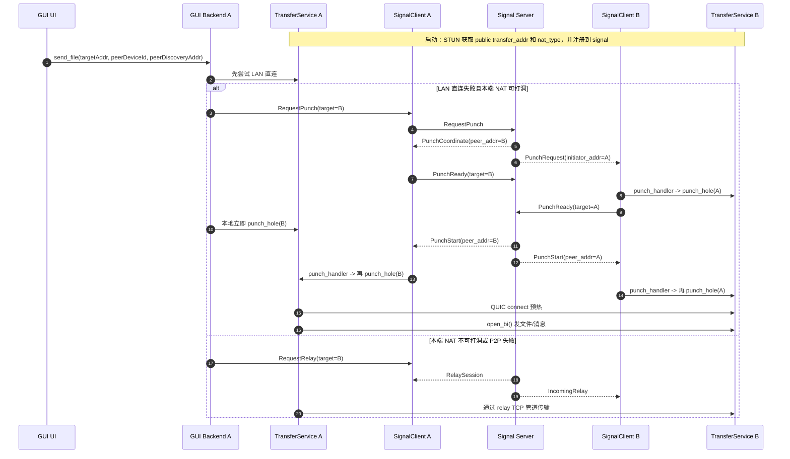

# NetFile 开发文档

## 项目架构

### 整体架构

NetFile 采用模块化设计，分为以下几个核心模块：

```
netfile/
├── crates/
│   ├── netfile-core/      # 核心库
│   ├── netfile-cli/       # CLI 工具
│   └── netfile-tui/       # TUI 界面
├── docs/                  # 文档
└── Cargo.toml            # Workspace 配置
```

### 模块依赖关系

```
netfile-cli ──┐
              ├──> netfile-core
netfile-tui ──┘
```

## 核心模块设计

### 1. 配置模块 (config)

**职责**: 管理应用配置

**主要结构**:
```rust
pub struct Config {
    pub instance: InstanceConfig,
    pub network: NetworkConfig,
    pub transfer: TransferConfig,
    pub security: SecurityConfig,
}
```

**关键功能**:
- 配置文件读写（TOML 格式）
- 默认配置生成
- UUID 生成（instance_id, device_id）

### 2. 发现模块 (discovery)

**职责**: 局域网设备发现

**主要结构**:
```rust
pub struct DiscoveryService {
    socket: Arc<UdpSocket>,
    devices: Arc<RwLock<HashMap<String, Device>>>,
    local_message: DiscoveryMessage,
    broadcast_interval: Duration,
}
```

**工作流程**:
1. UDP 广播发送本机信息
2. 接收其他设备的广播消息
3. 维护在线设备列表
4. 定期清理过期设备

**协议设计**:
```rust
pub struct DiscoveryMessage {
    pub device_id: String,
    pub instance_id: String,
    pub device_name: String,
    pub instance_name: String,
    pub port: u16,
    pub version: String,
}
```

### 3. 传输模块 (transfer)

**职责**: 文件传输管理

**主要结构**:
```rust
pub struct TransferService {
    listener: TcpListener,
    progress_tracker: Arc<ProgressTracker>,
    file_sender: Arc<FileSender>,
    file_receiver: Arc<FileReceiver>,
}
```

**传输流程**:

#### 发送端:
1. 扫描文件/目录
2. 建立 TCP 连接
3. 发送 TransferRequest
4. 分块读取文件
5. 发送 ChunkData
6. 等待 TransferComplete

#### 接收端:
1. 监听 TCP 连接
2. 接收 TransferRequest
3. 创建临时文件
4. 接收 ChunkData 并写入
5. 校验文件哈希
6. 重命名为最终文件

**协议消息**:
```rust
pub enum Message {
    TransferRequest(TransferRequest),
    ChunkData(ChunkData),
    TransferComplete(TransferComplete),
    TransferError(TransferError),
}
```

### 4. 压缩模块 (compression)

**职责**: 数据压缩/解压

**实现**: 使用 zstd 算法（压缩级别 3）

**优化策略**:
- 只压缩 >1024 字节的数据块
- 只在压缩后体积更小时使用压缩
- 接收端根据 compressed 标志自动解压

### 5. 安全模块 (auth, tls)

#### 认证模块 (auth)
```rust
pub struct AuthManager {
    allowed_devices: RwLock<HashSet<String>>,
    password_hash: RwLock<Option<String>>,
}
```

**功能**:
- 设备授权管理
- 密码哈希（SHA256）
- 密码验证

#### TLS 模块 (tls)
```rust
pub struct TlsManager {
    cert_path: PathBuf,
    key_path: PathBuf,
}
```

**功能**:
- 自签名证书生成（rcgen）
- TLS 服务器配置
- TLS 客户端配置

### 6. NAT 穿透与 P2P 建链模块

当前主流程的 NAT 穿透不是单独依赖 `hole_punch.rs`，而是由以下 4 个模块协同完成：

#### 6.1 `stun.rs`
```rust
pub struct StunClient {
    stun_servers: Vec<String>,
}
```

**职责**:
- 使用 `transfer_port` 对应的 UDP socket 查询公网地址。
- 在启动阶段检测 NAT 类型：`no_nat` / `cone` / `symmetric`。
- 为 signal 注册和后续 P2P 提供 `transfer_addr` 与 `nat_type`。

#### 6.2 `transfer/service.rs`
```rust
pub struct TransferService {
    quic_endpoint: Arc<quinn::Endpoint>,
    transfer_port: u16,
    public_addr: Arc<RwLock<Option<String>>>,
    nat_type: Arc<RwLock<NatType>>,
    connection_cache: Arc<RwLock<HashMap<SocketAddr, quinn::Connection>>>,
}
```

**职责**:
- 在同一个 `transfer_port` 上同时承载 QUIC 和 TCP relay 接入。
- `punch_hole(peer_addr)` 的实际动作是发起 `QUIC connect(peer_addr)`，成功后放入 `connection_cache`。
- 文件和消息发送都优先复用缓存好的 QUIC 连接。

#### 6.3 `signal_client.rs`
```rust
pub struct SignalClient {
    transfer_addr: Arc<RwLock<String>>,
    nat_type: Arc<RwLock<String>>,
    pending_punch: Arc<RwLock<HashMap<String, oneshot::Sender<String>>>>,
    punch_handler: Arc<RwLock<Option<Arc<dyn Fn(SocketAddr) + Send + Sync>>>>,
}
```

**职责**:
- 向 signal server 注册 `transfer_addr` 和 `nat_type`。
- 发送 `RequestPunch` / `PunchReady` / `RequestRelay`。
- 收到 `PunchRequest` / `PunchStart` 时触发 `punch_handler`，主 GUI 路径里这里会调用 `TransferService::punch_hole()`。

#### 6.4 `discovery/discovery.rs`
```rust
pub struct DiscoveryService {
    public_transfer_addr: Arc<RwLock<Option<String>>>,
}
```

**职责**:
- 维护局域网设备表和 `public_transfer_addr`。
- 发文件前可向对端 discovery 端口发送轻量 `PUNCH_REQUEST`，帮助局域网/已发现设备快速唤醒。

说明：
- `hole_punch.rs` 中的 `UdpHolePuncher` 仍然保留，但更接近独立实验/示例能力，当前 GUI 主流程并不直接依赖它完成 P2P 建链。

#### 6.5 工程排障视角时序图



#### 6.6 排障顺序

1. 先看启动阶段是否拿到 `public transfer_addr` 和 `nat_type`
   - 关键日志：
   - `STUN discovered public address for QUIC endpoint: ...`
   - `NAT type detected: ...`
   - 如果这里就拿不到公网地址，signal 注册时通常会带空 `transfer_addr`，后面 `RequestPunch` 大概率只会得到空地址或 fallback 地址。

2. 再看 signal 注册是否成功、地址是否上报
   - 关键日志：
   - `[punch-flow][signal-client] sending Register: ... transfer_addr=..., nat_type=...`
   - `[punch-flow][signal-client] received Registered: friends=..., observed_addr=...`
   - `[punch-flow][signal-client] update_transfer_addr: ...`
   - 如果客户端启动时 `transfer_addr` 为空，会尝试用 `observed_addr:local_transfer_port` 作为 fallback 再次上报。

3. 发文件时看 GUI 是否真的进入打洞分支
   - 关键日志：
   - `[punch-flow][gui] local nat_type=..., lan_addr=..., public_addr=...`
   - `[punch-flow][gui] requesting signal punch for peer_device_id=...`
   - 如果本端 NAT 判定为 `symmetric`，GUI 会跳过 `request_punch()`，直接偏向 relay。

4. 看 signal server 是否完成双边协调
   - 关键日志：
   - `[punch-flow][signal-server][...] RequestPunch target=..., nat_type=...`
   - `sent PunchCoordinate to initiator`
   - `sent PunchRequest to target`
   - `PunchReady key=..., initiator_ready=..., target_ready=...`
   - `both ready, sending PunchStart`
   - 如果卡在 `waiting peer PunchReady`，通常说明其中一端没有收到消息、没有设置 `punch_handler`，或连接已断开。

5. 看本地是否真的发起 QUIC connect
   - 关键日志：
   - `[punch-flow][gui] triggering local QUIC punch to ...`
   - `[punch-flow][signal-client] invoking punch handler for PunchRequest addr=...`
   - `[punch-flow][signal-client] invoking punch handler for PunchStart addr=...`
   - `Starting QUIC punch hole to ...`
   - `QUIC punch hole succeeded to ..., caching connection`
   - 如果只看到 signal 协调日志，看不到 `Starting QUIC punch hole`，说明 `punch_handler` 没挂上或回调没触发。

6. 看传输是否复用了已打通连接
   - 关键日志：
   - `Reusing cached QUIC connection to ...`
   - `Establishing new QUIC connection to ...`
   - 如果打洞成功但传输还重新建连失败，说明预热连接没有命中缓存，或者目标地址不一致。

7. 最后再看 relay 回退是否可用
   - 关键日志：
   - `[punch-flow][gui] direct transfer failed ..., trying relay fallback`
   - `[punch-flow][gui] requesting relay for peer_device_id=...`
   - `[punch-flow][signal-client] relay allocated: session_id=..., relay_server_addr=...`
   - 如果这里失败，优先检查 signal server 是否以 `--relay-port` 启动、防火墙是否放通 relay 端口。

#### 6.7 常见误区

- 主流程里的“打洞成功”并不等于 UDP `PUNCH/ACK` 成功，而是 QUIC 连接成功并进入缓存。
- `peer_nat_type` 虽然已在 signal 协议中传输，但当前客户端是否尝试 `request_punch()` 主要仍由“本端 NAT 是否 punchable”决定。
- 周期性 watcher 会刷新 `public transfer_addr` 并重新上报；`nat_type` 目前沿用启动阶段的检测结果，不会随 watcher 重新探测。

## 数据流设计

### 设备发现流程

```
Instance A                    Instance B
    |                             |
    |-- UDP Broadcast --------->  |
    |   (DiscoveryMessage)        |
    |                             |
    |  <-------- UDP Broadcast ---|
    |        (DiscoveryMessage)   |
    |                             |
    |-- Add to device list        |
    |                             |-- Add to device list
```

### 文件传输流程

```
Sender                        Receiver
  |                              |
  |-- TCP Connect ------------> |
  |                              |
  |-- TransferRequest ---------> |
  |                              |-- Create temp file
  |                              |
  |-- ChunkData (1) -----------> |-- Write chunk
  |-- ChunkData (2) -----------> |-- Write chunk
  |-- ChunkData (N) -----------> |-- Write chunk
  |                              |
  |-- TransferComplete --------> |-- Verify hash
  |                              |-- Rename file
  |                              |
  |  <-------- Success --------- |
```

### 断点续传流程

```
Sender                        Receiver
  |                              |
  |-- TransferRequest ---------> |-- Check existing file
  |                              |-- Load progress
  |                              |
  |  <-------- Resume from N --- |
  |                              |
  |-- ChunkData (N+1) ---------> |-- Write chunk
  |-- ChunkData (N+2) ---------> |-- Write chunk
  |                              |
  |-- TransferComplete --------> |-- Verify hash
```

## 开发指南

### 环境搭建

```bash
# 安装 Rust
curl --proto '=https' --tlsv1.2 -sSf https://sh.rustup.rs | sh

# 克隆项目
git clone https://github.com/yourusername/netfile.git
cd netfile

# 构建项目
cargo build

# 运行测试
cargo test

# 运行示例
cargo run --example test_discovery
```

### 代码规范

#### 命名规范
- 模块名: snake_case (如 `file_transfer`)
- 结构体: PascalCase (如 `TransferService`)
- 函数: snake_case (如 `send_file`)
- 常量: SCREAMING_SNAKE_CASE (如 `MAX_CHUNK_SIZE`)

#### 错误处理
- 使用 `anyhow::Result` 作为返回类型
- 使用 `?` 操作符传播错误
- 关键错误使用 `tracing::error!` 记录

#### 异步编程
- 使用 `tokio` 运行时
- I/O 操作必须使用异步函数
- 使用 `Arc<RwLock<T>>` 共享状态

### 添加新功能

#### 1. 添加新的传输协议消息

```rust
// 1. 在 protocol.rs 中定义消息
#[derive(Debug, Clone, Serialize, Deserialize)]
pub struct NewMessage {
    pub field1: String,
    pub field2: u64,
}

// 2. 添加到 Message 枚举
pub enum Message {
    // ... 现有消息
    NewMessage(NewMessage),
}

// 3. 在 transfer/service.rs 中处理消息
async fn handle_message(&self, msg: Message) -> Result<()> {
    match msg {
        Message::NewMessage(new_msg) => {
            // 处理逻辑
        }
        // ... 其他消息
    }
}
```

#### 2. 添加新的配置项

```rust
// 1. 在 config.rs 中添加字段
#[derive(Debug, Clone, Serialize, Deserialize)]
pub struct TransferConfig {
    // ... 现有字段
    pub new_option: bool,
}

// 2. 在 Default 实现中设置默认值
impl Default for TransferConfig {
    fn default() -> Self {
        Self {
            // ... 现有字段
            new_option: false,
        }
    }
}

// 3. 在使用处读取配置
let config = Config::load(&config_path)?;
if config.transfer.new_option {
    // 使用新选项
}
```

#### 3. 添加新的 CLI 命令

```rust
// 在 netfile-cli/src/main.rs 中添加子命令
#[derive(Subcommand)]
enum Commands {
    // ... 现有命令
    NewCommand {
        #[arg(short, long)]
        option: String,
    },
}

// 在 match 中处理命令
match cli.command {
    Commands::NewCommand { option } => {
        // 实现命令逻辑
    }
    // ... 其他命令
}
```

### 测试指南

#### 单元测试

```rust
#[cfg(test)]
mod tests {
    use super::*;

    #[test]
    fn test_function() {
        let result = function_to_test();
        assert_eq!(result, expected_value);
    }

    #[tokio::test]
    async fn test_async_function() {
        let result = async_function().await.unwrap();
        assert!(result.is_ok());
    }
}
```

#### 集成测试

```rust
// tests/integration_test.rs
use netfile_core::*;

#[tokio::test]
async fn test_file_transfer() {
    // 1. 启动服务
    let service = TransferService::new(0, 3, 1024*1024,
        PathBuf::from("/tmp/data"),
        PathBuf::from("/tmp/download"),
        false
    ).await.unwrap();

    // 2. 执行测试
    // ...

    // 3. 验证结果
    assert!(result.is_ok());
}
```

### 性能优化建议

#### 1. 减少内存拷贝
```rust
// 不好: 多次拷贝
let data = vec![0u8; size];
let compressed = compress(&data);
let sent = send(compressed.clone());

// 好: 使用引用
let data = vec![0u8; size];
let compressed = compress(&data);
let sent = send(&compressed);
```

#### 2. 使用缓冲 I/O
```rust
use tokio::io::BufReader;

let file = File::open(path).await?;
let mut reader = BufReader::new(file);
```

#### 3. 并发控制
```rust
use tokio::sync::Semaphore;

let semaphore = Arc::new(Semaphore::new(max_concurrent));
for task in tasks {
    let permit = semaphore.clone().acquire_owned().await?;
    tokio::spawn(async move {
        // 执行任务
        drop(permit);
    });
}
```

## 调试技巧

### 启用详细日志

```bash
# 设置日志级别
export RUST_LOG=debug

# 或针对特定模块
export RUST_LOG=netfile_core::transfer=debug

# 运行程序
cargo run
```

### 使用 tracing

```rust
use tracing::{debug, info, warn, error};

info!("Starting transfer: {}", file_name);
debug!("Chunk size: {}", chunk_size);
warn!("Slow transfer speed: {} MB/s", speed);
error!("Transfer failed: {}", error);
```

### 性能分析

```bash
# 使用 flamegraph
cargo install flamegraph
cargo flamegraph --bin netfile

# 使用 perf (Linux)
perf record -g cargo run --release
perf report
```

## 贡献指南

### 提交代码

1. Fork 项目
2. 创建特性分支: `git checkout -b feature/new-feature`
3. 提交更改: `git commit -m 'feat: 添加新功能'`
4. 推送分支: `git push origin feature/new-feature`
5. 创建 Pull Request

### Commit 规范

使用 Conventional Commits 格式：

```
<type>: <description>

[optional body]

[optional footer]
```

类型:
- `feat`: 新功能
- `fix`: 修复 bug
- `docs`: 文档更新
- `style`: 代码格式调整
- `refactor`: 重构
- `perf`: 性能优化
- `test`: 测试相关
- `chore`: 构建/工具链更改

### 代码审查清单

- [ ] 代码符合项目规范
- [ ] 添加了必要的测试
- [ ] 测试全部通过
- [ ] 更新了相关文档
- [ ] 没有引入新的警告
- [ ] 性能没有明显下降

## 常见问题

### Q: 如何添加新的传输协议？

**A**:
1. 在 `protocol.rs` 中定义新消息类型
2. 在 `Message` 枚举中添加新变体
3. 在 `TransferService` 中实现处理逻辑
4. 添加相应的测试

### Q: 如何优化传输速度？

**A**:
1. 增加 chunk_size（减少网络往返）
2. 增加 max_concurrent（并发传输）
3. 使用零拷贝技术（bytes::Bytes）
4. 启用压缩（适合文本文件）

### Q: 如何调试网络问题？

**A**:
1. 使用 Wireshark 抓包分析
2. 启用 RUST_LOG=debug 查看详细日志
3. 检查防火墙和端口配置
4. 使用 netstat 查看端口占用

## 参考资料

- [Tokio 文档](https://tokio.rs/)
- [Serde 文档](https://serde.rs/)
- [Ratatui 文档](https://ratatui.rs/)
- [Rust 异步编程](https://rust-lang.github.io/async-book/)
